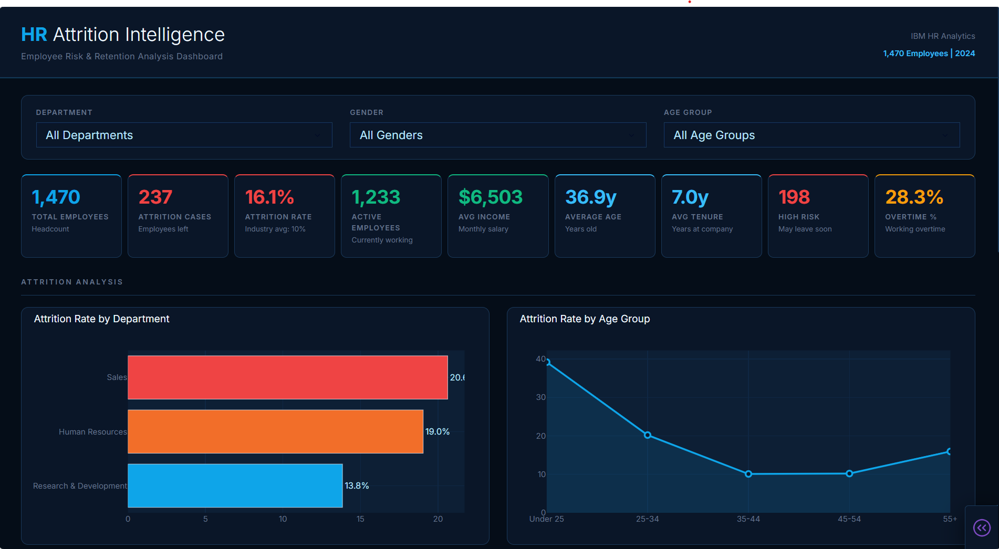
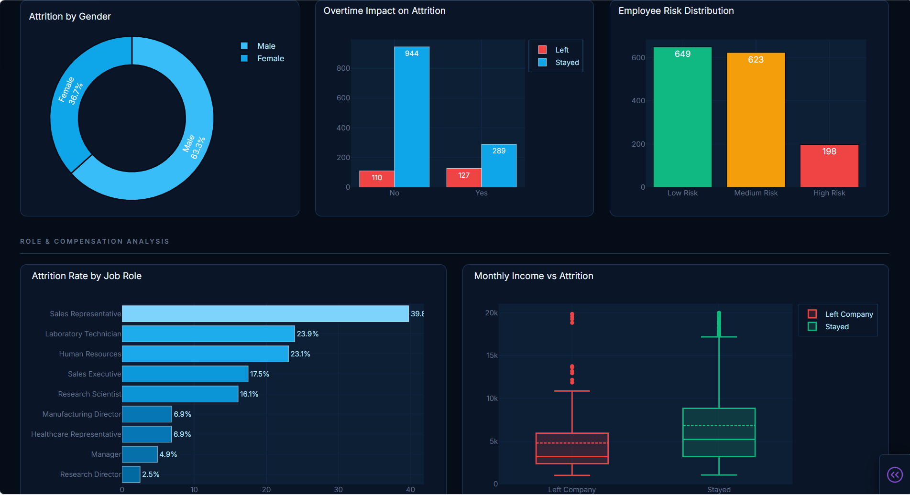

# 🧠 HR Attrition Intelligence Dashboard

> *"Why are employees really leaving?"*

---

## 📌 Overview
Deep analysis of employee attrition using 
IBM HR Analytics dataset of 1,470 employees.
Identifies high-risk employees & retention patterns.

## 🔍 Key Findings
- 📉 Overall attrition rate: 16.1% (Industry avg: 10%)
- 🏢 Sales dept = highest attrition (20%)
- ⏰ Overtime workers leave 2x more
- 👶 Employees under 25 most likely to quit
- ⚠️ 198 employees = High Risk (may leave soon)

## 🛠️ Tools Used

## 📊 Dashboard Preview

## 📁 Dataset
IBM HR Analytics — Kaggle
1,470 Employees | 2024
